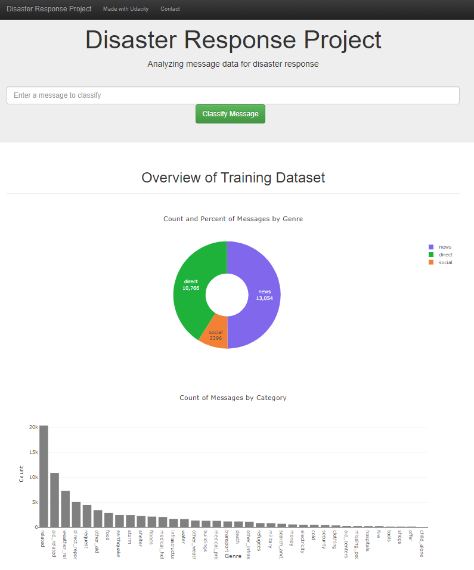
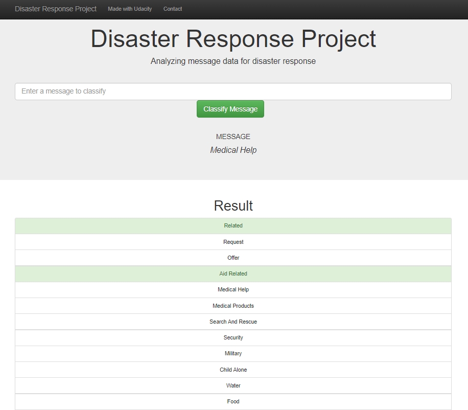

# Disaster Response Pipeline Project

### Table of Contents

1. [Project Motivation](#motivation)
2. [Files Descriptions](#files)
2. [Installation](#installation)
3. [Instructions](#instructions)
4. [Screenshots](#screenshots)
5. [Acknowledgements](#acknowledgements)

### Project Motivation & Overview 
This code is designed to iniate a web app which an emergency operators could exploit during a disaster (e.g. an earthquake or Tsunami), to classify a disaster text messages into several categories which then can be transmited to the responsible entity

### Files Descriptions 
The files structure is arranged as below:

	- README.md: read me file
	- ETL Pipeline Preparation.ipynb: contains ETL pipeline preparation code
	- ML Pipeline Preparation.ipynb: contains ML pipeline preparation code
	- workspace
		- \app
			- run.py: flask file to run the app
		    - \templates
                - master.html: main page of the web application 
                - go.html: result webpage
		- \data
			- disaster_categories.csv: categories dataset
			- disaster_messages.csv: messages dataset
			- DisasterResponse.db: disaster response database
			- process_data.py: ETL process
		- \models
			- train_classifier.py: classification code
            - classifier.pkl: training model matrix

### Installation 
All libraries are available in Anaconda distribution of Python. The used libraries are:
- pandas
- re
- sys
- json
- sklearn
- nltk
- sqlalchemy
- pickle
- Flask
- plotly
- sqlite3

*The code should run using Python versions 3.*.

### Instructions 
1. Run the following commands in the project's root directory to set up your database and model.

    - To run ETL pipeline that cleans data and stores in database
        `python data/process_data.py data/disaster_messages.csv data/disaster_categories.csv data/DisasterResponse.db`
    - To run ML pipeline that trains classifier and saves
        `python models/train_classifier.py data/DisasterResponse.db models/classifier.pkl`

2. Run the following command in the app's directory to run your web app.
    `python app/run.py`

3. Go to http://127.0.0.1:3001/ to open your localhost

### Screenshots 

Screenshot 1: App analysis of the data base

Screenshot 2: App word search Page

### Acknowledgements 
I would like to thank [Udacity](https://eu.udacity.com/) for this amazing project, and [Figure Eight](https://www.figure-eight.com/) for providing the relevant dataset to train the model.
